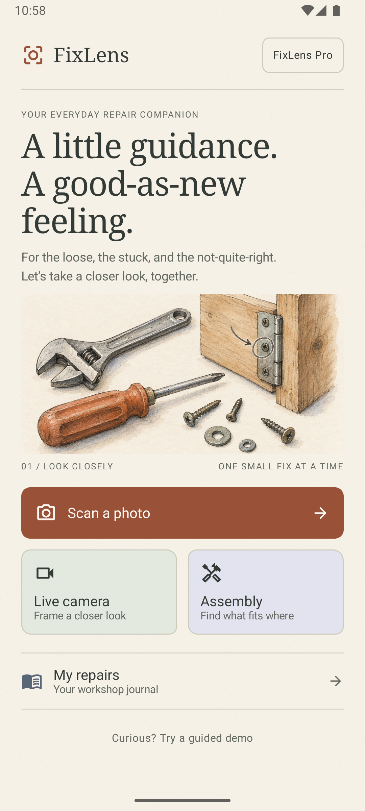
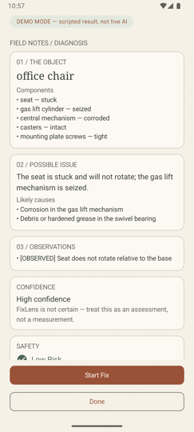
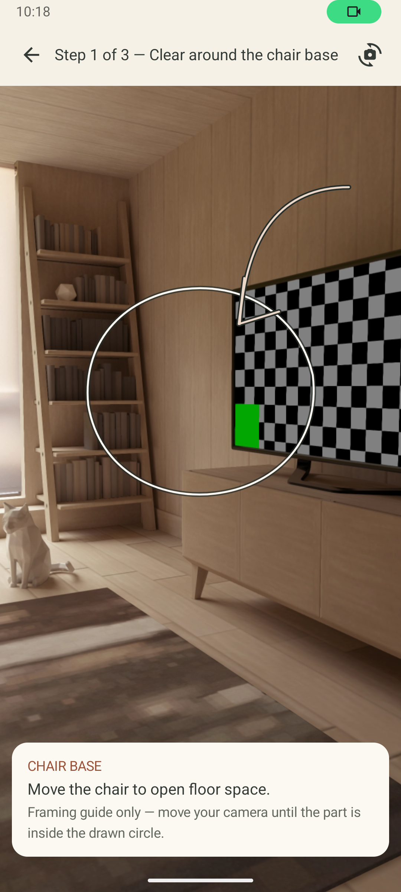
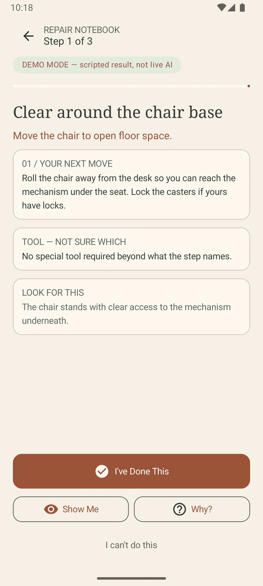
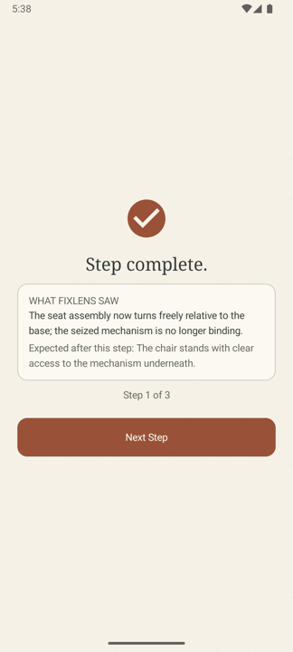
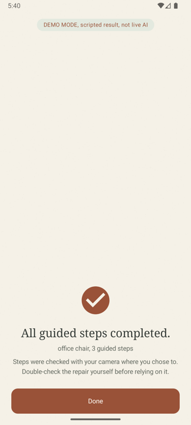
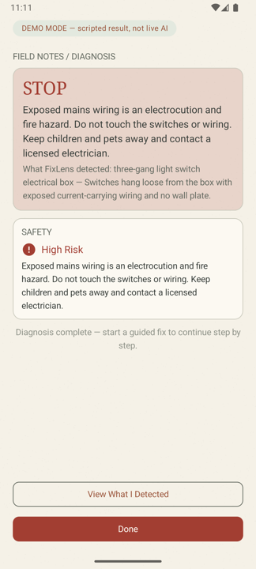
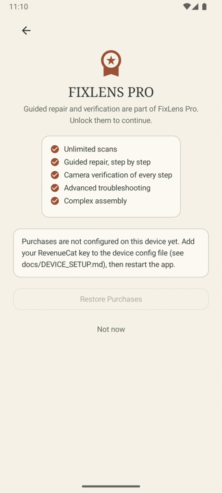
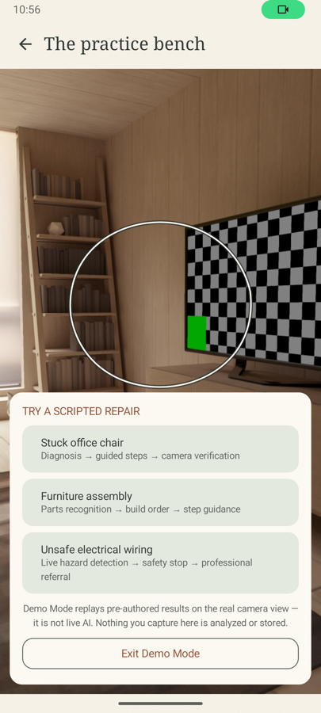
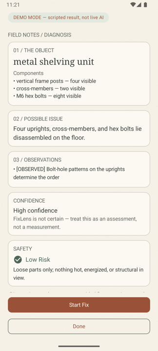

# FixLens

**Point. See. Fix.**, a camera-first AI repair companion that looks at the
world through your camera, tells you what it sees and whether it's safe to
touch, walks you through the repair step by step, marks exactly where to look
with a hand-drawn target on the live view, and verifies your work with a
follow-up scan before letting you move on.

FixLens is a mobile AI technician, deliberately **not** a chatbot. There is
no free-text surface anywhere in the app: the camera does the asking.

| Home | Diagnosis | Show Me (live target) | Guided step |
|---|---|---|---|
|  |  |  |  |

> **Status:** all build phases complete · app `v0.8.0-phase8` · backend `v0.6.0`
> · backend tests **109/109** · Android tests **72/72** · lint clean
>
> **Visual identity:** an illustrated workshop-journal look, warm paper
> background with subtle grain, charcoal ink, terracotta and sage watercolor
> washes, serif editorial headings over a humanist sans body, and sketchy
> hand-drawn target overlays drawn directly onto the camera view.
>
> **Interactive guidance:** the diagnosis, the assembly plan, and every
> repair step speak themselves (on-device text to speech with a header mute
> toggle), each step shows an animated **HOW IT MOVES**
> diagram whose hand-drawn arrow matches the action verb (move, rotate,
> press, lift, slide, fasten, place, apply), and confirms key moments with
> haptics. Verification verdicts are spoken and felt. The pricing page is
> always visible, even before a store key is configured.

---

## What FixLens does

The full camera-first loop works end to end on device:

1. **Observe**, *Scan a photo* or *Live camera*: a photo captured in the app
   travels to the FastAPI backend, through the Gemini/OpenRouter vision
   providers. Poor images (dark, blank, too small) are rejected by a quality
   gate **before** any AI quota is spent.
2. **Understand**, the diagnosis renders as a field-note layout:
   **I SEE** → **POSSIBLE ISSUE** → **WHAT I FOUND** (observed vs inferred
   components) → **CONFIDENCE** (controlled band, never a fake percentage) →
   **SAFETY** (deterministic policy, not model opinion).
3. **Instruct**, *Start Fix* generates a structured plan once per session:
   numbered steps with **DO THIS**, **TOOL**, **CAREFUL**, and
   **WHAT YOU SHOULD SEE AFTER** cards.
4. **Target**, **Show Me** overlays a sketchy ink contour and pencilled
   arrow on the live camera, marking where to look and what to move or
   tighten, like an instructor's pencil on your view of the world.
5. **Verify**, every step can be proven with a fresh camera scan:
   **PASS / INCOMPLETE / UNCERTAIN** (+ evidence). Only PASS advances a step;
   the app never claims success without visual evidence, and UNCERTAIN always
   carries exactly one specific better-view instruction.
6. **Refuse unsafe work**, HIGH-risk diagnoses produce a **safety stop**
   before any generation: no steps, no workarounds, just the hazard, the
   reason, and a referral to a licensed professional.
7. **Tell it what's wrong (optional)**, on the capture review screen you can
   type a symptom or tap a chip ("Loose", "Wobbly", "Stuck", "Not turning",
   "Missing part"). The camera stays the evidence: the backend treats your
   text as the user's report to focus the analysis, never as proof, and the
   diagnosis still says what the image actually shows.

### Also on board

- **Assembly mode**, photograph disassembled parts and get an ordered build
  plan (parts list + steps), or an explicit *"I can't determine the order
  yet"* naming the one view that would settle it. Order is never guessed.
- **Demo Mode**, three deterministic scripted journeys (stuck office chair,
  furniture assembly, unsafe electrical wiring) on the real camera,
  permanently badged **"DEMO MODE, scripted result, not live AI"**, for a
  network-risk-free product demo. Nothing captured in Demo Mode is analyzed
  or stored.
- **My repairs**, a workshop journal of past scans and repairs.
- **Monetization**, RevenueCat-gated guided repair/assembly/verification
  with real purchase state (never faked or cached), Restore, an honest
  "not configured" state when no key is present, and ONE opt-in rewarded
  ad placement: a free user out of scans may watch a short ad for one
  bonus scan, never for Pro, never for safety information.

| Verification | Completion | Safety stop | Paywall | Demo picker | Assembly |
|---|---|---|---|---|---|
|  |  |  |  |  |  |

More captures live in [`docs/design/`](docs/design/): camera capture screen
with the sketch ring (`camera.png`), the capture review screen with the
optional "What is broken?" symptom input (`review.png`), the rewarded
bonus-scan offer and its earned state (`rewarded-ad.png`), large-text
accessibility check (`home-large-text.png`).

---

## Visual identity, the watercolor workshop

FixLens avoids the standard purple-blue "AI app" look on purpose. The
interface is an illustrated field guide: warm paper, charcoal ink, watercolor
washes, hand-drawn annotations, editorial typography. Palette (from
`android/.../ui/theme/Theme.kt`):

| Swatch | Name | Hex | Used for |
|---|---|---|---|
| 🟨 | Paper | `#F5F1E7` | App background (with subtle grain flecks) |
| ⬜ | Cream | `#FCF9F2` | Cards and raised surfaces |
| ⬛ | Ink | `#343A36` | Primary text and outlines (never pure black) |
| | Muted ink | `#636960` | Secondary text |
| 🟫 | Terracotta | `#995238` | Primary actions, progress, accents |
| | Clay wash | `#EBD7C8` | Warm tint containers |
| 🟩 | Sage | `#E3E9DF` | Secondary washes, success, demo banner |
| | Sage ink | `#4E6657` | Low-risk / positive text |
| 🟪 | Lavender | `#E2E3EE` | Tertiary washes |
| | Blue gray | `#586677` | Journal accents |
| | Rule | `#CCCBBE` | Hairline separators and card borders |
| 🟥 | Danger | `#A23E32` | Safety stop, HIGH risk |
| | Camera ink | `#282E2A` | Sketch overlays on the camera view |

Typography pairs a **serif display** family (headings: warm, editorial,
"repair manual") with a **humanist sans-serif** body, both system families,
so the app stays offline-safe and respects accessibility font scaling.
Hand-drawn details are real code, not images: `Workshop.kt` draws the paper
grain, sketchy ink contours, and pencilled arrows with Compose `Canvas`.

---

## The core loop

```
OBSERVE -> UNDERSTAND -> SAFETY DECISION -> INSTRUCT -> USER ACTS -> VERIFY -> NEXT STEP
```

The camera is the primary interface, FixLens is deliberately not a chatbot.
The loop is enforced end to end: the diagnosis layout mirrors it, the guided
repair drives it, and the completion screen stops at an honest
*"All guided steps completed, steps were checked with your camera where you
chose to. Double-check the repair yourself before relying on it."*

## Architecture

```
Android (Kotlin, Jetpack Compose, Material 3, CameraX)
   │  capture / review / analyze (user-triggered only)
   │  POST /api/v1/diagnose   (multipart JPEG)
   │  POST /api/v1/plan       (validated diagnosis JSON → repair plan)
   │  POST /api/v1/assembly   (parts photo → assembly plan)
   │  POST /api/v1/verify     (fresh capture + step expected state →
   │                           PASS / INCOMPLETE / UNCERTAIN verification)
   ▼
FastAPI backend (Python)
   ├─ image validation + quality gate (dark/blank/too-small rejected)
   │   + resize/compress (Pillow)
   ├─ provider selector: Gemini ──unavailable──▶ OpenRouter (configurable)
   ├─ strict Pydantic validation (malformed model output can never pass)
   ├─ deterministic safety policy, runs BEFORE plan generation:
   │    HIGH → BLOCKED_HIGH_RISK, no instructions ever generated;
   │    MEDIUM → plan + requires_acknowledgement; better-view/no-issue blocked
   └─ structured logging (no keys, no images)
   ▼
Android renders the diagnosis layout (I SEE / POSSIBLE ISSUE / WHAT I FOUND /
CONFIDENCE / SAFETY · better-view request · safety stop), then on Start Fix
the guided repair screen: STEP x OF y · title · action · DO THIS · TOOL ·
CAREFUL · WHAT YOU SHOULD SEE AFTER · [I've Done This] [Show Me] [Why?]
[I can't do this], driven by a pure-Kotlin repair state machine
(IDLE → PLAN_READY → … → REPAIR_COMPLETE) with no AI coupling.
```

- **Provider abstraction** (`backend/app/providers/`): `AIProvider` interface
  with `GeminiProvider` and `OpenRouterProvider`. Selection is configuration
  only (`AI_PROVIDER`, `AI_FALLBACK_PROVIDER`); model IDs are configurable
  candidate lists (first model that answers wins).
- **Safety policy** (`backend/app/safety.py`): deterministic keyword gate
  that can escalate the model's assessment; HIGH risk always produces a
  SAFETY_STOP and discards actionable instructions. It runs **before** any
  plan generation, verified live with zero model invocations on blocked
  requests (see `FIXLENS_PROGRESS.md`).
- **Secrets stay server-side.** AI keys live only in `backend/.env`
  (git-ignored). The Android app never sees a provider key.

## Repository layout

```
/android    Android app (Kotlin + Jetpack Compose + Material 3 + CameraX)
/backend    FastAPI service: /health, /api/v1/diagnose, /api/v1/plan,
            /api/v1/assembly, /api/v1/verify
/docs       DEVICE_SETUP.md (device runbook) · design/ (screenshots),
            WORKSHOP_DESIGN.md (visual identity notes)
/assets     icon_1024.png, 1024×1024 app icon (watercolor lens mark)
FIXLENS_MASTER_BUILD_SPEC.md   Single source of truth (product spec)
FIXLENS_PROGRESS.md            Phase-by-phase build log + final audit
FIXLENS_ARCHITECTURE.md        Historical Phase-1 architecture plan
DEVPOST_SUBMISSION.md          Shipaton 2026 submission content
LICENSE                        MIT
```

## Device configuration

All external identifiers live in ONE developer-provided device config file
(never compiled into the app). Written per device/AVD:

```bash
adb shell "run-as com.fixlens.app sh -c 'cat > files/fixlens.properties'" <<'EOF'
backend.url=http://127.0.0.1:8000
revenuecat.api_key=testn_YOUR_TEST_STORE_KEY_FROM_DASHBOARD
EOF
```

`revenuecat.api_key` = the app-specific **Test Store API key** from the
RevenueCat dashboard (Project Settings → API keys). Without it, the app runs
in free mode: the 3-scans/month allowance still counts, but purchases are
disabled and the paywall says so honestly. Optional overrides:
`revenuecat.entitlement` (default `fixlens_pro`), `revenuecat.product_monthly`
(default `fixlens_monthly`), `revenuecat.product_annual` (default
`fixlens_annual`), `revenuecat.product_pack5` (default
`fixlens_repair_pack_5`), `revenuecat.product_pack10` (default
`fixlens_repair_pack_10`). Restart the app after changing the file.

**Never ship a Test Store key**: the RevenueCat SDK crashes release builds
on purpose when it finds one, swap to your platform store key before any
production build.

## Quick start

1. **Backend**

   ```bash
   cd backend
   python3 -m venv .venv
   source .venv/bin/activate
   pip install -r requirements.txt
   cp .env.example .env        # then fill in GEMINI_API_KEY / OPENROUTER_API_KEY
   uvicorn app.main:app --host 127.0.0.1 --port 8000
   curl http://127.0.0.1:8000/health   # {"status":"ok","version":"0.6.0"}
   ```

2. **Android**, follow `docs/DEVICE_SETUP.md` (developer options → USB
   debugging → `adb reverse tcp:8000 tcp:8000` → device config → installDebug).
   Android Studio: open `android/` and press Run.

3. **Try it without any setup**, on Home, tap **"Curious? Try a guided
   demo"** and pick a scenario. Demo Mode needs no backend, no keys, and no
   network: it walks the real product screens (diagnosis → guided steps →
   camera verification → completion) with pre-authored results, honestly
   badged on every screen. The wiring scenario demonstrates the safety stop.

4. **Test the live AI pipeline**, *Scan a Photo* → capture anything →
   *Use image* → the diagnosis screen appears with the real analysis. If the
   photo is too dark, blank, or blurry, FixLens asks for a better image
   before spending any AI quota; if the evidence is insufficient, the result
   shows **I NEED A BETTER VIEW** with a specific camera instruction. On
   free-tier vision models a scan can take up to two minutes, the app says
   so and offers retries.

5. **Test guided repair**, on a GUIDE/LOW-risk diagnosis, tap *Start Fix*:
   the plan is generated once, then each step offers *I've Done This*,
   *Show Me* (live camera + sketchy target ring + the instruction), *Why?,
   and *I can't do this* (skip with an explicit dialog). Steps can be
   verified with a camera scan (PASS / INCOMPLETE / UNCERTAIN). MEDIUM-risk
   diagnoses show a BEFORE YOU START acknowledgement gate first. HIGH-risk
   diagnoses show the safety stop and never offer Start Fix.

6. **Test assembly mode**, *Assembly* → photograph disassembled parts →
   *Get assembly steps*: either an ordered plan (parts list + numbered steps)
   or an explicit "I can't determine the order yet" screen naming the one
   view that would settle the order, the order is never guessed.

## Environment variables (`backend/.env`)

| Variable | Purpose |
|---|---|
| `GEMINI_API_KEY` | Google Gemini API key (primary provider) |
| `OPENROUTER_API_KEY` | OpenRouter key (fallback provider) |
| `AI_PROVIDER` | `gemini` (default) or `openrouter` |
| `AI_FALLBACK_PROVIDER` | Provider used when the primary is unavailable |
| `GEMINI_MODELS` | Comma-separated candidate models (first that answers wins) |
| `OPENROUTER_MODEL(S)` | Specific free vision model(s), never a random router |
| `DIAGNOSE_TIMEOUT_SECONDS` | Request timeout (default 75) |

Never commit `.env`. `.gitignore` already excludes it.

## Monetization (RevenueCat)

| Product | Type | Price |
|---|---|---|
| `fixlens_monthly` | Subscription | $9.99 / month |
| `fixlens_annual` | Subscription | $79.99 / year |
| `fixlens_lifetime` | One-time | $99.99 |
| `fixlens_repair_pack_5` | One-time pack | $3.99 |
| `fixlens_repair_pack_10` | One-time pack | $6.99 |

All products unlock the `fixlens_pro` entitlement. Free plan: **3 scans per
month**. Safety information is never paywalled, everyone gets the full
diagnosis including the safety assessment; Pro gates the *work* (guided
repair, Show Me, verification, assembly). Purchase state is real RevenueCat
state, never faked or cached, with Restore and an honest "not configured"
state. Credits from repair packs are granted exactly once per transaction.

The paywall is a full **pricing page**: with a store key configured it shows
live RevenueCat prices and a computed annual-savings badge; without one it
shows the same catalog as a clearly-labeled planned-catalog sketch with the
real prices, so the monetization story is visible to reviewers either way.

## Tests

```bash
cd backend && .venv/bin/python -m pytest tests/ -v   # 109 tests (offline)
cd android && ./gradlew :app:testDebugUnitTest       # 72 tests (JVM + MockWebServer)
cd android && ./gradlew :app:assembleDebug :app:lintDebug   # build + lint (zero warnings)
```

Backend endpoint tests inject fake providers, no API quota is consumed by
the test suite. Live AI verification and full emulator E2E runs (including
the safety stop and the demo-driven guided loop) are recorded in
`FIXLENS_PROGRESS.md`.

## Build status

- ✅ Phase 1: Android foundation (navigation, Photo/Live camera, permissions,
  My Repairs), FastAPI `/health`, adb-reverse device connectivity
- ✅ Phase 2: AI diagnosis pipeline, provider abstraction, Gemini primary,
  OpenRouter fallback, strict validation, deterministic safety gate
- ✅ Phase 3: perception + diagnosis, components with OBSERVED/INFERRED
  distinction, controlled confidence bands, image quality gate, user-context
  handling (symptom ≠ evidence), spec §10 diagnosis layout, safety-stop and
  better-view variants; verified live with 6 real-image scenarios and
  end-to-end on the emulator
- ✅ Phase 4: guided repair + assembly, structured repair plans
  (`POST /api/v1/plan`, generated once per session), safety-before-generation
  gate (HIGH blocked, MEDIUM acknowledgement), pure-Kotlin repair state
  machine, step-by-step guidance screen, Show Me target overlay, honest tool
  identification, difficult-step skip flow, assembly mode with
  order-uncertainty handling
- ✅ Phase 5: camera-based verification, `POST /api/v1/verify` compares a
  fresh capture against a step's expected state (PASS / INCOMPLETE /
  UNCERTAIN + evidence; UNCERTAIN always carries exactly one better-view
  instruction; PASS never guessed without visual evidence). Only PASS
  advances a step; the user may skip verification (their own confirmation
  then completes it, never worded as verified)
- ✅ Phase 6: RevenueCat monetization, real RevenueCat SDK with Test Store
  support, `fixlens_pro` entitlement checked against live purchase state,
  paywall with Pro monthly/annual + one-time Repair Packs + Restore, free
  plan of 3 scans/month, gating woven into the flow with resume-after-unlock
- ✅ Phase 7: Demo Mode, three deterministic scripted journeys on the real
  camera, permanently badged "DEMO MODE, scripted result, not live AI",
  network-risk-free; demo picker + router + honest banners on every screen
- ✅ Phase 8: final polish, animations (entrances, safety-icon pop, progress,
  `animateContentSize`), accessible semantics on shutters and controls,
  large-text check, zero-warning lint
- ✅ Phase 9: final audit, backend 109/109, Android 72/72, live E2E on the
  emulator (real Gemini diagnosis, safety stop with zero model calls, demo
  guided loop), secrets scan clean, submission assets prepared
- ✅ Visual identity: watercolor workshop-journal restyle, paper/ink palette,
  serif editorial typography, hand-drawn Canvas details, verified by build,
  tests, and emulator E2E + screenshots
- ✅ Interactive guidance: on-device voice guide for steps, verification
  verdicts, and completion (mute toggle included), animated HOW IT MOVES
  step diagrams with verb-matched hand-drawn arrows, haptics on confirm,
  PASS, completion, and the safety stop, and an always-visible pricing page
  with a planned-catalog fallback when purchases are unconfigured

## Known limitations

- Free-tier AI quotas (Gemini daily cap; OpenRouter per-model free pools) can
  rate-limit analysis at busy times, the app shows an honest error and the
  request can be retried. Latency of 46-150 s per scan is normal on free
  tiers and is communicated in the UI.
- The model can misjudge unusual photos; the deterministic safety layer can
  escalate but cannot make the model see things the image does not show.
- The safety corpus matches hazard phrases, not meaning: a NEGATED sentence
  like "no exposed wiring" still escalates (deliberately conservative,
  false blocks are safer than missed hazards).
- Show Me targets are approximate: the ring marks where to look in frame;
  there is no per-frame component tracking (and no per-frame AI calls).
- Physical-phone verification of the full flow is still pending (all device
  verification so far ran on the API 35 emulator).

## Hackathon submission (RevenueCat Shipaton 2026)

- **Repo:** https://github.com/khushi-infinity/FixLens
- **App icon (1024×1024, uncropped):** [`assets/icon_1024.png`](assets/icon_1024.png)
- **Frameless screenshots:** [`docs/design/`](docs/design/)
- **Submission copy** (elevator pitch, tagline, project story, and draft
  answers for every award field): [`DEVPOST_SUBMISSION.md`](DEVPOST_SUBMISSION.md)
- Awards targeted: Build in Public · HAMM (monetization) · RevenueCat Peace
  Prize · RevenueCat Design Award · Next Gen (student)

## License

[MIT](LICENSE)
